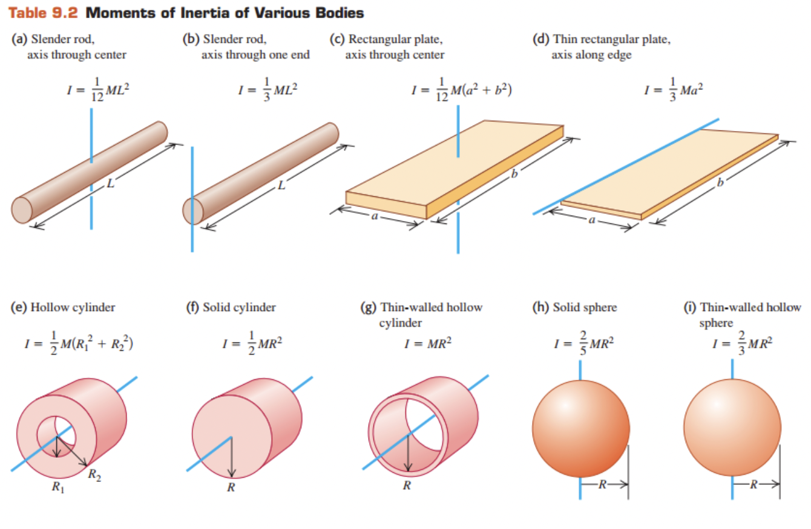

```{r, include = FALSE}
knitr::opts_chunk$set(
  collapse = TRUE,
  comment = "#>"
)
```

```{r setup, include=FALSE}
library(MoI)
```

In this page, I introduce Moment of Inertia (MoI) R package that includes several functions for calculating MoI of several 3D objects.

# Section 1: Graphical Illustration of MoI
```{r pressure, echo=FALSE, out.width = '100%'}

```

# Section 2: Functions for calculating MoI
## Function 1: Hoop() 
A function for calculating MoI of a hoop. It has the following parameters: `m` for mass (kilograms), `r` for radius (meter), `axiss` to represent reference axis on which rotation takes place. Options are `geometrical axis`,`perp. to surface and center`.

Example:
`Hoop(7, 2, "geometrical axis")`

## Function 2: RectPlate()
A function for calculating MoI of a rectangular plate. It has the following parameters: `m` for mass (kilograms), `l1` side1 length (meter), `l2` side2 length(meter), `axiss` to represent reference axis on which rotation takes place. Options are `perp. center axis`,`along edge`

Example:
`RectPlate(7, 2, 14, "perp. center axis")`

## Function 3: Rod()
A function for calculating MoI of a rod. It has the following parameters: `m` for mass (kilograms), `l` for length (meter), `axiss` to represent reference axis on which rotation takes place. Options are `perp. center`,`diameter of surface`.

Example:
`Rod(5, 7, "diameter of surface")`

## Function 4: SolidCylinder()
A function for calculating MoI of a solid cylinder. It has the following parameters: `m` for mass (kilograms), `r` for radius (meter),`l` for length (meter), `axiss` to represent reference axis on which rotation takes place. Options are `geometrical axis`,`along surface`,`perp. to surface and center`,`diameter of surface`.

Example:
`SolidCylinder(5, 3, 7, "geometrical axis")`

## Function 5: Sphere()
A function for calculating MoI of a sphere. It has the following parameters: `m` for mass (kilograms), `r` for radius (meter),`type` for either `solid` or `shell`, `axiss` to represent reference axis on which rotation takes place. Options are `diameter`,`tangent`.

Example:
`Sphere(2, 6, "solid", "tangent")`
